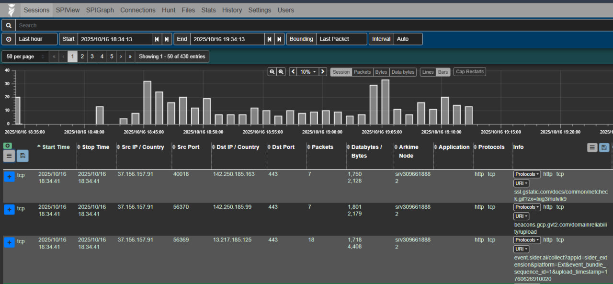

# ⚙️ Arkime Wise Service Integration

This repository provides a **custom Arkime Wise Service plugin** that enriches Arkime session data with detailed application and traffic metadata from the Flask API of the [Network Data Pipeline](https://github.com/your-org/network-data-pipeline).  
It forms the **final enrichment layer** in the overall observability architecture.

---

## 🧠 Overview

Arkime (formerly Moloch) uses a **Wise Service** to dynamically enrich captured network sessions with metadata such as category, risk level, protocol, and other analytical fields.

This custom Wise plugin — `source.myService.js` — queries the Flask API running in the **Data Pipeline** repository. The API provides enriched information for each session (e.g., risk score, byte/packet counts, protocol statistics), and Arkime displays them in its **Session Detail View**.

The enriched fields are also visualized in the **Observability Dashboard** (Repository 1) for analytical and statistical insights.

---

## 🔗 Integration with Other Repositories

### 🧩 1. [`network-data-pipeline`](https://github.com/ArkimeNetLab/network-data-pipeline)
- Runs a Flask API service at `http://127.0.0.1:5000/enrich`
- Provides enrichment data (risk, category, byte counts, duration, etc.)
- The Wise Service (this repo) queries that API for each Arkime session

### 📊 2. [`netflow-observability-dashboard`](https://github.com/ArkimeNetLab/netflow-observability-dashboard)
- Uses the enriched fields stored by Arkime to render advanced visualizations
- Shows aggregated statistics, traffic risk trends, and flow analysis based on the same fields defined here

---

## 🏗️ Architecture Overview

```

```
      ┌─────────────────────────────┐
      │ Network Data Pipeline (Flask)│
      │  → /enrich endpoint          │
      │  → provides enrichment JSON  │
      └────────────┬────────────────┘
                   │
                   ▼
      ┌─────────────────────────────┐
      │ Arkime Wise Service (this)  │
      │  → Queries Flask API        │
      │  → Defines custom fields    │
      │  → Sends enriched results   │
      └────────────┬────────────────┘
                   │
                   ▼
      ┌─────────────────────────────┐
      │ Arkime Session Viewer       │
      │  → Displays extra columns   │
      │  → Exports enriched data    │
      └─────────────────────────────┘
```

```

---

## 📁 Repository Structure

```

arkime-wise-integration/
│
├── source.myService.js    # Main Wise Service plugin for Arkime
└── README.md

````

---

## ⚙️ How It Works

1. **Arkime** captures network sessions as normal.  
2. For each session (identified by tuple: src IP, dst IP, ports, protocol), Arkime requests enrichment data from this **Wise plugin**.  
3. `source.myService.js` parses the tuple key, constructs a request to `http://<flask_host>:5000/enrich`, and waits for a JSON response.  
4. The plugin encodes all fields from the Flask response using the `WISESource.encodeResult()` function.  
5. The enriched fields appear in Arkime under your defined prefixes (e.g., `myService.app_protocol`, `myService.risk_score_total`, etc.).  

---

## 🔧 Configuration

1. **Copy the plugin** into Arkime’s Wise directory:
   ```bash
   cp source.myService.js /opt/arkime/wiseService/

2. **Add configuration** to `/opt/arkime/etc/wise.ini`:

   ```ini
    [wise]
    debug=1
    [myService]
    host=localhost
   ```
2. **Add configuration** to `/opt/arkime/etc/config.ini`:

   ```ini
    # --- Wise Plugin Settings ---
    viewerPlugins=wise.js
    plugins=wise.so
    wise=true

    # --- Wise Service Connection ---
    wiseURL=http://127.0.0.1:8081

    # --- Tuple Lookup Configuration ---
    wiseTcpTupleLookups=true
    wiseUdpTupleLookups=true

    # --- Cache Management ---
    wiseCacheSecs=0
    wiseMaxCache=1000
   ```
4. **Restart Wise Service:**

   ```bash
   sudo systemctl restart arkimewise
   sudo systemctl restart arkimecapture
   sudo systemctl restart arkimeviewer
   ```
---

## 🧩 Defined Fields

Below are the fields added by default.
They correspond to the enriched dataset produced by the pipeline’s Flask API.

| Field Name                    | Kind    | Friendly Name        | Description                                  |
| ----------------------------- | ------- | -------------------- | -------------------------------------------- |
| `myService.app_protocol`      | string  | App Protocol         | Application protocol detected by nDPI        |
| `myService.app_category`      | string  | App Category         | App classification (Social, Streaming, etc.) |
| `myService.app_risk`          | string  | App Risk             | Risk level from enrichment model             |
| `myService.duration`          | float   | Flow Duration (s)    | Flow lifetime in seconds                     |
| `myService.protocol`          | string  | L4 Protocol          | Transport layer protocol (TCP/UDP)           |
| `myService.src2dst_bytes`     | integer | Src→Dst Bytes        | Bytes sent from source to destination        |
| `myService.dst2src_bytes`     | integer | Dst→Src Bytes        | Bytes sent from destination to source        |
| `myService.src2dst_packets`   | integer | Src→Dst Packets      | Packet count source→destination              |
| `myService.dst2src_packets`   | integer | Dst→Src Packets      | Packet count destination→source              |
| `myService.data_ratio`        | float   | Data Ratio           | Ratio of sent vs received bytes              |
| `myService.iat_flow_avg`      | float   | IAT Flow Avg         | Average Inter-Arrival Time of packets        |
| `myService.pktlen_c_to_s_avg` | float   | C→S Pktlen Avg       | Mean packet size client→server               |
| `myService.pktlen_s_to_c_avg` | float   | S→C Pktlen Avg       | Mean packet size server→client               |
| `myService.tcp_ack_count`     | integer | TCP ACK Count        | Number of TCP ACK packets                    |
| `myService.tcp_psh_count`     | integer | TCP PSH Count        | Number of TCP PSH packets                    |
| `myService.encrypted`         | integer | Encrypted            | Binary flag (1 = encrypted)                  |
| `myService.breed`             | string  | App Breed            | Broad class (e.g., P2P, Web, Streaming)      |
| `myService.confidence`        | string  | Detection Confidence | Confidence of classification                 |
| `myService.risk_score_total`  | integer | Total Risk Score     | Aggregated risk metric                       |

---

## 🧱 Extending the Plugin (Add Your Own Fields)

Developers can easily add more fields using the **same pattern** demonstrated in this repository.
Here’s how:

1. Inside the plugin’s constructor (`class MyService extends WISESource`), add a new field with:

   ```js
   this.myNewField = this.api.addField(
     'field:myService.my_new_field;db:myService.my_new_field;kind:string;friendly:My New Field'
   );
   ```

2. Return it in the encoded result inside `getTuple()`:

   ```js
   const buf = WISESource.encodeResult(
     this.myNewField, data?.my_new_field ?? 'N/A',
     // ...existing fields...
   );
   ```

3. Restart the Wise service, and Arkime will automatically recognize and index your new field.

🧩 **Example:**
If you wanted to add `tls_version` and `packet_loss_rate` from your enrichment data:

```js
this.tlsVersionField = this.api.addField(
  'field:myService.tls_version;db:myService.tls_version;kind:string;friendly:TLS Version'
);
this.packetLossField = this.api.addField(
  'field:myService.packet_loss;db:myService.packet_loss;kind:float;friendly:Packet Loss Rate'
);
```

And in `getTuple()`:

```js
this.tlsVersionField, data?.tls_version ?? 'N/A',
this.packetLossField, data?.packet_loss ?? 0.0,
```

That’s it — Arkime will now display these additional attributes automatically!

---

## 🔄 API Interaction

Each enrichment request is an HTTP GET to the Flask service in the pipeline repository:

```
GET http://127.0.0.1:5000/enrich?src_ip=10.0.0.1&dest_ip=10.0.0.2&src_port=443&dst_port=58000&proto=TCP
```

The Flask API (Repository 2) responds with JSON:

```json
{
  "app_protocol": "HTTPS",
  "app_category": "Web",
  "app_risk": "Low",
  "duration": 3.4,
  "src2dst_bytes": 2890,
  "dst2src_bytes": 1203,
  "risk_score_total": 2
}
```

The Wise plugin extracts each key and encodes it as Arkime session fields.

<p align="center">
  
  
</p>

## 📚 Related Repositories

* [`netflow-observability-dashboard`](https://github.com/your-org/netflow-observability-dashboard)
* [`network-data-pipeline`](https://github.com/your-org/network-data-pipeline)
